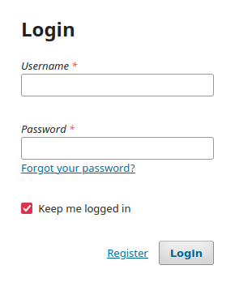

# Navodila za uporabo sistema OJS s strani urednikov - Acta Chimica Slovenica

- [Navodila za uporabo sistema OJS s strani urednikov - Acta Chimica Slovenica](#navodila-za-uporabo-sistema-ojs-s-strani-urednikov---acta-chimica-slovenica)
  - [Splošne opombe](#splošne-opombe)
  - [Prijava v sistem](#prijava-v-sistem)
  - [Oddaja članka (avtor)](#oddaja-članka-avtor)
  - [Splošno okno z vlogami](#splošno-okno-z-vlogami)
  - [Menjava gesla](#menjava-gesla)
    - [Pozabljeno geslo](#pozabljeno-geslo)
  - [Uredništvo (glavni urednik)](#uredništvo-glavni-urednik)
    - [Obdelava pravkar prispetega članka (glavni urednik)](#obdelava-pravkar-prispetega-članka-glavni-urednik)
      - [Zavračanje prispelega članka (glavni urednik)](#zavračanje-prispelega-članka-glavni-urednik)
      - [Izbira urednika sekcije za izvedbo recenzije (glavni urednik)](#izbira-urednika-sekcije-za-izvedbo-recenzije-glavni-urednik)
      - [Izbor urednika sekcije (glavni urednik)](#izbor-urednika-sekcije-glavni-urednik)
  - [Delo urednika sekcije](#delo-urednika-sekcije)
    - [Določanje recenzentov](#določanje-recenzentov)
    - [Odločitev urednika po izvedbi recenzij](#odločitev-urednika-po-izvedbi-recenzij)
    - [Kako avtor izvede popravke](#kako-avtor-izvede-popravke)
    - [Urednikovo delo po popravkih](#urednikovo-delo-po-popravkih)
    - [Splošno o komunikaciji in evidenci](#splošno-o-komunikaciji-in-evidenci)
  - [Proofreading in delo tehničnega urednika](#proofreading-in-delo-tehničnega-urednika)
    - [Stanje pred pripravo proofov](#stanje-pred-pripravo-proofov)
    - [Priprava proofov in nalaganje v sistem](#priprava-proofov-in-nalaganje-v-sistem)
    - [Poziv avtorju za pregled "proofa"](#poziv-avtorju-za-pregled-proofa)
    - [Avtor obveščen, izvede pregled](#avtor-obveščen-izvede-pregled)
    - [Sprejem in pregled komentarjev s strani editorja](#sprejem-in-pregled-komentarjev-s-strani-editorja)
  - [Objavljanje](#objavljanje)
    - [Upravljane Issue-ov](#upravljane-issue-ov)
      - [Create Issue](#create-issue)
      - [Back Issues/Future Issues](#back-issuesfuture-issues)
    - [Umestitev članka v ISSUE](#umestitev-članka-v-issue)
      - [Urejanje meta podatkov](#urejanje-meta-podatkov)
      - [Nalaganje galley-ev](#nalaganje-galley-ev)


## Splošne opombe

Sistem se nahaja na naslovu:

> http://journals.matheo.si/index.php/ACSi/

Ta dokument je namenjen pregledu uporabe sistema *Open Journal Systems* za revijo *Acta Chimica Slovenica* s strani urednikov sekcij.

Pod svojimi uporabniškimi imeni nastopate lahko v vlogah avtorjev, recenzentov ali urednikov sekcij.

V primeru vprašanj, me lahko kontaktirate:

```
Alen Orbanić
alen@abelium.eu
031 432 805
```

## Prijava v sistem

Obiščite povezavo:

> http://journals.matheo.si/index.php/ACSi

V desnem zgornjem kotu se nahaja okno za prijavo.



Vnesite uporabniško ime in geslo ter pritisnite `Login`.

## Oddaja članka (avtor)

Sledite navodilom v izbiri `ABOUT` (menijska vrstica na vrhu strani), *Author Guidelines*.

## Splošno okno z vlogami

Po prijavi bodisi takoj pridemo na naslednjo bodisi lahko izberemo v menijski vrstici na zgornjem delu strani USER HOME.

???

V okviru publikacije Acta Chimica Slovenica ima vsak uporabnik določene vloge. Z izbiro vloge na strani USER HOME vstopimo v ustrezno vlogo. Uredniki imajo vloge Editor (glavni urednik) ali Section Editor, večina uporabnikov pa ima še vlogi Author in Reviewer. Izberemo vlogo, v kateri želimo trenutno delovati.

## Menjava gesla

V splošnem oknu z vlogami imamo tudi rubriko za upravljanje svojega dostopa (MY ACCOUNT) ter izbiro Change My Password, ki omogoča spremembo gesla.

???

Odpre se okno, v katerega navedemo staro geslo in dvakrat novo geslo ter pritisnemo Save.

### Pozabljeno geslo

... se ne moremo prijaviti. Lahko pa na vrhu strani v menijski vrstici izberemo izbiro LOGIN, ter uporabimo povezavo Forgot your password? Uporabniški dostopi so vezani na email naslove. Odpre se stran na kateri vnesete svoj email, ki pripada dostopu ter pritisnete gumb Reset Password. Dobili boste email za ponastavitev gesla, kjer sledite navodilom.
 
???

## Uredništvo (glavni urednik)

Glavni urednik ima vlogo Editor. Sekcijski uredniki imajo vlogo Section Editor. V tem razdelku govorimo le o vlogi glavnega urednika. V oknu za vloge izberemo vlogo Editor.

???

Odpre se stran EDITOR HOME. V zgornjem delu strani so seznami člankov v obdelavi glede na njihov status:
    • Unassigned - pravkar oddani, glavni urednik jih mora pregledati in bodisi zavrniti ali predati urednikom sekcij
    • In Review - pri urednikih sekcij ter morda v recenziji
    • In Editing - sprejeti članki, obdeluje jih tehnični urednik
    • Archives - sprejeti in zavrnjeni članki (objavljeni ali arhivirani)

V spodnjem delu so izbire za objavo, s katerimi bo operiral tehnični urednik.

### Obdelava pravkar prispetega članka (glavni urednik)

Pravkar oddani članki se nahajajo pod rubriko Unassigned. Na strani EDITOR HOME izberemo Unassigned.  Pojavi se nam seznam prispelih in trenutno nedodeljenih člankov.

???

S klikom na naslov članka začnemo z njegovim pregledom in obdelavo (glavni urednik).

???

Pojavi se kartoteka članka. Na vrhu je možnih 5 izbir: 
    • SUMMARY (osnovni podatki o oddanem članku)
    • REVIEW (podatki o recenziji članka - to upravljajo Section Editorji)
    • EDITING (podatki o obdelavi sprejetih člankov)
    • HISTORY (evidenca vse komunikacije povezane s člankom)
    • REFERENCES (reference članka)

Tipično glavni urednik pregleduje pod SUMMARY, urednik sekcije pod REVIEW,  tehnični urednik pa pod EDITING. 

Za prejeti članek je naloga glavnega urednika, da članek bodisi zavrne, poprosi za ponovno oddajo ali članek dodeli ustreznemu uredniku sekcije.

#### Zavračanje prispelega članka (glavni urednik)

Na strani SUMMARY  v rubriki STATUS izberemo REJECT AND ARCHIVE SUBMISSION. 

???

Odpre se okno za pošiljanje emaila. V naprej pripravljen email lahko dopolnimo in pošljemo (gumb Send na dnu strani). TRUDIMO SE, DA POŠILJAMO VSE EMAILE PREKO APLIKACIJE, SAJ LE TAKO OHRANJAMO SLEDLJIVOST.

#### Izbira urednika sekcije za izvedbo recenzije (glavni urednik)

V kolikor je članek ustrezno oddan in primeren za revijo in recenzijo, glavni urednik določi urednika sekcije, ki bo poskrbel za izvedbo recenzij in podal končno odločitev glede objave članka. Glavni urednik izbere urednika preko strani SUMMARY, in sicer v rubriki EDITORS.

???

Tu lahko izbere:
    • ADD SECTION EDITOR (dodelitev uredniku sekcije)
    • ADD EDITOR (dodelitev drugemu editorju - če je več glavnih urednikov - za vas je to nerelevantno)
    • ADD SELF (dodelitev sebe kot urednika)
    
#### Izbor urednika sekcije (glavni urednik)

Po pritisku na izbiro ADD SECTION EDITOR lahko izberemo urednika sekcije, ki mu dodelimo članek v obdelavo. Na seznamu najdemo ustreznega urednika sekcije in izberemo ASSIGN.

???

## Delo urednika sekcije

Urednik sekcije nastopa v vlogi Section Editor (USER HOME, izbor Section Editor)

Uvodna stran v vlogi Section Editor vsebuje tri kategorije člankov glede na status (IN REVIEW,  IN EDITING ter ARCHIVES), pri čemer imamo pri prvih dveh kategorijah ustrezen mavrični seznam glede na status trenutnega članka (stopnja izvedbe recenzije, stopnja tehnične obdelave). Urednik sekcije tipično operira zgolj s članki v statusu IN REVIEW.

???

Tabela v mavričnem seznamu nam v ustreznih stolpcih kaže stanje dela recenzentov:
    • ASK - datum prošnje za vsakega zaprošenega recenzenta
    • DUE - če so recenzenti sprejeli recenzijo, so sprejeli tudi rok
    • DONE - datum izvedbe recenzije
    • RULING - datum odločitve urednika
    
### Določanje recenzentov

V mavričnem seznamu pod kategorijo IN REVIEW izberemo članek za obdelavo/pregled s klikom na naslov. Odpre se stran REVIEW kartoteke članka.
Urednik sekcije najprej v poglavju SUBMISSION preveri, katere izmed oddanih datotek so primerne za recenzenta. Tipično nobeden Supplementary File razen Novelty File ne gre k recenzentu. V kolikor glavni urednik še ni izvedel izbire, urednik sekcije okljuka ustrezne priloge in pritisne Record ob njih.

???

V rubriki PEERREVIEW lahko urednik sekcije izbere recenzenta. Recenzija lahko poteka v več krogih. Prvi krog je označen z ROUND 1. Za izbiro recenzenta urednik sekcije uporabi izbiro SELECT REVIEWER.

Odpre se okno s potencialnimi recenzenti, med katerimi lahko urednik sekcije izbere s pritiskom na izbiro ASSIGN ob imenu ustreznega recenzenta. Recenzenti so podani v tabeli ob njih pa so tudi razne statistike. V kolikor je v sistemu več potencialnih recenzentov, je možno po njih iskati glede na različne kriterije (Search).

???

Če nekega recenzenta še ni v sistemu, ga lahko urednik sekcije doda. V ta namen lahko izbere eno izmed možnosti (izbire nad seznamom):
    • ENROLL EXISTING USER AS REVIEWER (izbor med registriranimi uporabniki, ki pa se niso sami javili za recenzente - niso še v tej vlogi)
    • CREATE NEW REVIEWER (vnos neregistriranega uporabnika)

Za nove potencialne recenzente se bo praviloma uporabljala druga opcija (CREATE NEW REVIEWER). Tipično urednik sekcije pozna ime, priimek in email potencialnega recenzenta, kar zadostuje za ustvarjanje recenzenta. Izberemo CREATE NEW REVIEWER.

Odpre se okno za vpis podatkov o novem uporabniku (recenzentu). Obvezna polja so:
    • First Name
    • Last Name
    • Username (lahko uporabimo gumb Suggest, potem ko vnesemo ime in priimek)
    • email

???

Po vnosu pritisnemo gumb Save. Dodan urednik se avtomatično doda med kandidate za recenzente na strani REVIEW v kartoteki 

???

Na enak način lahko dodamo še enega ali več kandidatov za recenzente.

V listu REVIEW kartoteke članka lahko v rubriki PEERREVIEW ob izbranem recenzentu pod napisom REQUEST pritisnemo pisemce in na ta način inicializiramo pošiljanje pošte s prošnjo potencialnemu recenzentu. Odpre se okno za pošiljanje v naprej pripravljene pošte.

???

V kolikor želimo izvesti kak popravek iz predloge avtomatično generiranega emaila, to storimo, če ne pripravljen email s pritiskom na gumb Send pošljemo kandidatu za recenzenta. Po pošiljanju se vrnemo na stran REVIEW v kartoteki članka. V rubriki PEERREVIEW je zabeležen datum poziva recenzenta.

???

V kolikor se recenzent ne bo odzval v določenem obdobju (5 dni), bo sistem avtomatično še enkrat poslal opomnik (enak email). V kolikor urednik sekcije želi posebej opozoriti kandidata za recenzenta, lahko uporabi pisemce ob datumu pod napisom REQUEST.

Obstaja tudi možnost, če bi recenzent na nek drug način povedal uredniku sekcije, da (ne) sprejme članek v recenzijo. Za ta primer ima urednik sekcije možnost, da sam spremeni status recenzenta z izbirama WILL DO THE REVIEW oz. UNABLE TO DO THE REVIEW.

Kandidat za recenzenta prejme email s posebno povezavo, ki vodi direktno do strani na kateri vidi naslov, povzetek in lahko sprejme ali zavrne recenzijo (t.i. one-click review - recenzentu se ni potrebno prijaviti v sistem, ampak operira s sistemom zgolj preko te strani, do katere povezavo ima v emailu). Šele ko kandidat za recenzenta potrdi, da bo lahko recenziral članek, se mu na tej strani pojavi povezava do manuscripta (Word) ter povezave do dodatnih datotek (npr. Novelty file).
 
Ko recenzent sprejme članek v recenzijo, urednik sekcije dobi ustrezen email, hkrati pa se rubriki PEERREVIEW spremeni status recenzenta: pod UNDERWAY se zabeleži datum sprejema v recenzijo. Pod DUE je datum roka izvedbe recenzije. S klikom na ta datum urednik sekcije lahko datum spremeni. Po zamujenem tem datumu sistem avtomatično pošlje opomnik. Opomnik lahko pošlje kadarkoli tudi urednik sekcije z izbiro SEND REMINDER.

???

Če bi urednik sekcije na kak drug način izven sistema pridobil recenzijo v elektronski obliki, jo lahko s pomočjo izbire Upload review naloži v sistem (zaradi evidence). Namesto recenzenta lahko preko izbire RECOMMENDATION urednik vnese recenzentovo odločitev. V večini primerov pa računamo, da bo recenzent preko povezave v emailu izpolnil Evaluation Form, podal pripombe ter podal svojo odločitev. 
Ko se to zgodi, dobimo nov status.

???

Iz statusa je razvidnen datum odločitve, odločitev (v konkretnem primeru Revisions required), s pritiskom na "oblaček" lahko pogledamo vsebino Evaluation Form (Review Form Response). Vidimo tudi morebitne naložene datoteke s strani recenzenta, za katere se po pregledu (klik na ime datoteke) lahko odločimo, ali jih bo lahko dobil avtor na vpogled. To se odločimo preko okljukanja ustreznega polja in pritiska na gumb Record. Smiselno je še oceniti recenzenta (Review Rating - izbira ocene ter pritisk gumba Record). Ocena bo gotovo koristna pri kasnejšem izbiranju recenzentov. Smiselno je tudi potrditi recenzijo z vljudnostno pošto - pritisk na pisemce pod ACKNOWLEDGE ter pošiljanje v naprej pripravljenega emaila.

V splošnem bosta pozvana vsaj dva recenzenta (Reviewer A, Reviewer B), v veliko primerih pa tudi več, če bodo le-ti recenzije odklanjali.

### Odločitev urednika po izvedbi recenzij

Po izvedbi vseh potrebnih recenzij je naloga urednika sekcije, da avtorju poda svojo odločitev na osnovi recenzij. To stori v rubriki EDITOR DECISION.

???

V tej rubriki iz seznama izbere odločitev ter pritisne gumb Record Decision. Za vsak tip odločitve je smiselno potem še poslati ustrezen email avtorju preko pritiska na pisemce pod Notify Author. Odločitvi Accept Submission in Decline Submission sta končni in prestavita članek bodisi v status IN EDITING (tehničnemu uredniku) bodisi v arhiv. Odločitev Revisions required je vmesna odločitev s katero avtorju sugeriramo, naj pripravi popravke in jih ponovno naloži. V tem primeru najprej sprejmemo to odločitev ter nato obvestimo avtorja (Notify author). Odpre se pripravljen email, ki je nekoliko bolj zapleten.

???

Preko gumba Import Peer Reviews omogoča namreč uvoz tistih delov Evaluation Form vseh recenzentov, ki so označene kot vidne za avtorja (trenutno samo komentar za avtorja). Po pritisku se v tekstovni obliki pripnejo na koncu besedila emaila. Ker je email relativno dolg, preverimo (večkratni pritiski večkrat pripnejo isto vsebino!)

Po potrebi lahko emailu dodamo priponke. Če sta recenzenta naložila svoji priponki, lahko avtor dostopa do njih preko svojega uporabniškega računa (kartoteke članka). Te priponke se privzeto ne dodajo kot priponke k temu emailu. V primeru, da urednik sekcije to želi, mora priponke recenzentov najprej naložiti iz spletne strani in jih potem pripeti temu emailu.

### Kako avtor izvede popravke

Avtor v kartoteki članka vidi odločitev urednika sekcije v rubriki EDITOR DECISION.

???

Glede na navodila v emailu s pomočjo Upload Author Verison lahko naloži poljubne popravke (zaželjeno da v skladu z navodili). Čim to stori, lahko preko izbire Notify Editor urednika o tem obvesti. Sicer pa se ob prvi naloženi datoteki status za urednika spremeni. 

### Urednikovo delo po popravkih

Urednik po opravljnih popravkih s strani avtorja te preveri. Če niso ustrezni lahko preko Notify Author obvesti avtorja o dodatnih popravkih. V kolikor lahko urednik sekcije sam odloči, da so glede na recenzije popravki primerni, lahko urednik v rubriki EDITOR DECISION spremeni svojo odločitev na Accept Submission (izbira iz seznama ter pritisk gumba Record Decision). Če pa je potreben ponoven pregled recenzentov, pa izbere izbiro Resubmit for Review (in spet gumb Record Decision).

???

Da urednik sekcije začne naslednji krog pregledov članka s strani obeh (vseh) recenzentov mora še izmed s strani avtorja naloženih datoke z izbiro pod Review Version izbrati ustrezno datoteko in pritisniti gumb Resubmit.

Rubrika PEERREVIEW se ustrezno spremeni in začne se drugi krog (ROUND 2). 

???

Nadaljnji potek recenzije je za urednika enak kot v prvem krogu (pisemce za REQUEST, čakanje na recenzentovo potrditev, čakanje na odločitev in na koncu nova odločitev urednika sekcije).

### Splošno o komunikaciji in evidenci

Kakršna koli komunikacija z avtorjem lahko v kateri koli fazi recenzije poteka preko izbire pisemca v rubriki EDITOR DECISION (Notify Author). Glede na status je tudi vedno možna komunikacija s posameznim recenzentom. Smiselno je vedno pošiljati pošto preko sistema, saj se to potem v sistemu beleži in potem ni potrebe za skrb glede sledljivosti. Emaili, ki jih dobivate na privatni email naslov pa vam služijo bolj kot opomniki in ne kot evidenca.
Če se striktno držite komunikacije preko sistema, so vsi emaili shranjeni v HISTORY (izbira na vrhu strani).

???

Vsa stanja članka se beležijo v EVENT LOG.

???

## Proofreading in delo tehničnega urednika

### Stanje pred pripravo proofov

Kot je dogovorjeno, naj bi Editorji za sprejeti članek v zavihku REVIEW pod EDITOR DECISION in možnostjo Editor Version naložili zadnjo verzijo, ki so mogoče še oni kaj popravili in dodali na koncu:
- slovenski prevod
- navedbo zvrsti

???


### Priprava proofov in nalaganje v sistem

Na osnovi tega tehnični urednik pripravi PDF "proofe", ki zaenkrat še nimajo paginacije. Ti proofi se naložijo v zavihku EDITING v rubriki Layout. Uporabi se možnost Upload file to pri čemer se izbere možnost Galley (okrogli izbirni gumb). Pritisnete najprej gumb Browse, izberete ustrezno datoteko v PDF formatu in nato pritisnete gumb Upload.

???

Po pritisku gumba Upload se odpre naslednje okno.

???

V tem oknu ni potrebno ničesar nastavljati. Pritisnete gumb Save.

### Poziv avtorju za pregled "proofa"

Na dnu strani v zavihku EDITING je rubrika PROOFREADING.

???

Uporabljali bomo samo proofreading s strani avtorja (prva vrstica, Author).
S pisemcem v stolpcu REQEST odpremo email naslovljen na avtorja pripravljen po predlogi (PROOFREAD AUTHOR REQUEST).  Predpripravljen email po potrebi dopolnimo in ga pošljemo s pritiskom na gumb Send.

???

V rubriki PROOFREADING se spremeni status:

???

### Avtor obveščen, izvede pregled 

Avtor dobi obvestilo.

???

Ko sledi povezavi, se mora najprej prijaviti:

???

Ko vstopi, vidi naslednjo stran:

???

Za klikniti mora na svoj članek in iti v zavihek EDITING. Sicer pa, če je že prijavljen, ga povezava usmeri direktno na zavihek editing konkretnega članka.

???

Avtor lahko do "proofa" dostopa v rubriki LAYOUT pod izbiro VIEW PROOF.

Na dnu strani je tudi rubrika PROOFREADING. Z uporabo oblačka, lahko avtor odda komentarje. 

???

Vnos komentarjev je možen v obrazcu:

???

Avtor lahko shranjuje ali shrani in pošlje komentarje (s tem zaključi proof reading).

Če avtor shrani in še ne pošlje popravkov, lahko kasneje s pomočjo "oblačka" dodaja/briše/popravlja kometarje.

???

S pritiskom na pisemce na koncu vrstice Author v rubriki PROOFREADING avtor odda komentarje in zaključi s proofreadingom. Pri tem se mu odpre predizpolnjena predloga za email (PROOFREAD AUTHOR COMPLETE).

### Sprejem in pregled komentarjev s strani editorja

Vsi shranjeni komentarji so vidni s strani editorja.

???

Ko se proofreading zaključi je to označeno v stolpcu COMPLETE.  Takrat se pojavi tudi pisemce v stolpcu ACKNOWLEDGE, kjer se lahko avtorju zahvalimo (email: PROOFREAD AUTHOR ACK).

???

## Objavljanje

### Upravljane Issue-ov
V vlogi Editor lahko odpiramo in upravljami z "revijami", ki se imenujejo "Issue". 

???

Do možnosti za urejanje Issue-ov pridemo tako, da v osnovnem meniju USER HOME izberemo vlogo Editor, ki nas popelje na stran EDITOR HOME. Na dnu strani je odsek za uporavljanje Issue-ov. 

???

Pomembne izbire so:
    • Create Issue - formalno odpremo nov Issue, v katerega lahko umeščamo objave
    • Future Issue - seznam še neobjavljenih issueov. Vsak Issue je lahko objavljen (Published ali ne)
    • Back Issue - seznam že objavljenih issue-ov

	
#### Create Issue

S pomočjo te izbire ustvarimo nov Issue. Glede na nastavitve sistema, ima vsak Issue avtomatično te parametre: Volume, Number, Year. Možno je te parametre vklopiti/izklopiti in dodati še parameter Title. Vse to se nastavlja v poglavju Identification.

???

V poglavju Cover je možno dodati cover image za številko. 

#### Back Issues/Future Issues

Gre za seznam že objavljenih issue-ov.

???

Tu lahko bodisi brišemo objavljene issue (tipično ne) in urejamo njihov vrstni red v arhivu. Eden izmed objavljenih issue-ov je lahko nastavljne na CURRENT. 

S klikom na link ob imenu posameznega issue-a vstopimo na stran za njegovo urejanje.

???

Na tej strani imamo tri rubrike:

- TABLE OF CONTENTS - razporeditev člankov znotraj issue-a in paginacija
- ISSUE DATA - nastavitve za issue kot pri Create Issue
- ISSUE GALLEYS - morebitni PDF celotne številke (ne bomo uporabljali, saj bodo članki objavljeni v posameznih PDF).

Za nas bo najbolj zanimiva rubrika TABLE OF CONTENTS.

???

V tej rubriki lahko določamo naslednje:
- vrstni red sekcij (puščice gor dol ob poglavjih, ki predstavljajo sekcije). Privzeti vrstni red se določi na nivoju sistema (pri definiciji sectionov - naredi administrator)
- vrstni red članka znotraj sekcije (puščice gor-dol ob člankih)
- (uradna) paginacija članka - ko članek nima paginacije, je na voljo galley brez paginacije in polje za paginacijo je prazno. Ko se kasneje naloži galley z paginacijo, se v tej rubriki popravi paginacijo v ustreznih tekstovnih poljih.

POZOR: pri akcijah povezanih z ISSUE-i nimamo možnosti dodajanja članka v issue. Dodelitev članka na ISSUE se izvaja preko kartoteke članka. Članek mora biti dodeljen v ISSUE preko kartoteke članka, da bi bil viden v ISSUE-u.

Na dnu strani rubrike TABLE OF CONTENTS je tudi gumb za objavo ali umik ISSUE-a (Publish/Unpublish issue). Spremembe na strani (paginacija, puščice shranjujemo s pomočjo gumba Save.

???

Dodatne nastavitve za Issue

V rubriki ISSUE data je kot dodatna nastavitev možna še nastavitev COVER page. 

???

???

Da jo lahko nastavimo, moramo okljukati izbiro Create a cover for this issue with the following elements.
Pri izbiri Cover Image lahko naložimo cover image, ki pa mora biti ustrezno oblikovana (velikost, robovi s krem barvo ali ostri). V Cover caption lahko napišemo tekst, ki se pojavi ob glavi številke. POZOR: oblikovanje Cover caption je lahko nekoliko bolj zahtevno, saj je mogoče potrebno editiranje direktno v HTML obliki, da bi se doseglo zaželjene stile (gumb HTML) v editorju. Pri oblikovnju vsebine tekstovnega polja Cover caption lahko v začetku dokler se proces ne ustali nudimo podporo, v kolikor bi besedila bila zahtevnejša (potrebno je direktno nastaviti določene stile, da bo ustrezen izris).

Glede na vsebino se pri pregledu objav (povezavi CURRENT in ARCHIVE) na vrhu strani, avtomatično oblikuje "thumbnail" kot na spodnji sliki. Pri tem se vsebina tekstovnega polja pojavi levo, slika desno. Naslov s povezavo se zgenerira zgoraj desno in vodi do ločene strani, preko katere se da dostopati do kazala in člankov. 

???

Thumbnail issue-a

???

Podstran issue-a 

???

Kazalo člankov v issue

???

Stran posameznega članka

### Umestitev članka v ISSUE

Članek umeščamo v ISSUE preko kartoteke članka v zavihku EDITING, rubrika SCHEDULING. Članek uvrstimo v ISSUE preko izbire in pritiska gumba RECORD. POZOR: če je ISSUE že objavljen (Published) bo članek šel v arhiv (to je pomembno, da vemo kje je - ne bo več v EDITING ampak v ARCHIVE). Če issue ni objavljen, se članek nahaja v EDITING.

???

Potrebni pogoji za objavo članka so:
- urejeni podatki o avtorjih, title, abstract, keywords, cover image - uporabimo zavihek SUMMARY, poglavje SUBMISSION METADATA, povezava EDIT METADATA.
- naložen ustrezen GALLEY


#### Urejanje meta podatkov

Pri urejanju meta podatkov uredimo avtorje (rubrika AUTHORS) tako, da po potrebi dopolnimo ali pravopisno ustrezno napišemo njihova imena (first name in last name) in affiliatione, če je smiselno (morda za prvega avtorja). Četudi so navedeni drugi kontakti (npr. emaili) jih NE BRIŠEMO - sistem je nastavljen tako, da jih uporablja, jih pa ne objavlja ob člankih.

???

V rubriki TITLE AND ABSTRACT po potrebi popravimo naslov in abstract. Če sta ti rubriki urejeni v skladu s pisavo, ki jo zahteva PUBMED, bomo podatke lahko uporabili tudi za izvoz v PUBMED XML.

???

Za posamezen članek je potrebno dodati še graphical abstract. V ta namen vklopimo "Create a cover for this article with the following elements" in naložimo ustrezno oblikovano sliko v poglavju COVER.

???

V poglavju INDEXING po potrebi popravimo ključne besede, ki morajo biti ločene s podpičji.

???

V poglavju DISPLAY uporabimo nastavitev kot na spodnji sliki.

???

Popravljene podatke shranjujemo s pritiskom na gumb Save Metadata.

#### Nalaganje galley-ev

V zavihku EDITING kartoteke članka, v poglavju Layout lahko naložimo PDF galleye. 

???

Nalaganje izvedemo s pomočjo izbire "Upload file to", izbira "Galley", ter uporabimo gumba Browse in Upload, da naložimo datoteko. Ob  pritisku na gumb Upload se odpre spodnja stran.

???

Na tej strani kvečjemu popravimo Label (tipično je PDF, ki se generira avtomatično v redu), saj se ta label kaže v kot glava povezave do pdf datoteke. Če imamo za kak članek še appendixe, jih prav tako naložimo kot Galleye, le da ta label naredimo drugačen.

Pazimo - z zaporednim nalaganjem Galleyev se ti kopičijo - objavljajo se vsi, ki so naloženi v odseku Layout, podrubriki Galley format. V kolikor kako od starejših objav Galleya ne želimo več imeti, uporabimo povezavo DELETE.

???

Če povzamemo, je proces objave naslednji (predpostavimo, da ustrezen issue obstaja):
- članku uredimo metadata (avtorji, title, abstract, graphical abstract, keywords)
- članku naložimo ustrezen galley (lahko še ne paginiran)
- članek dodelimo na issue (Scheduling)

Članku lahko večkrat spremenimo galleye (kartoteko najdemo v arhivu, če je issue že objavljen!), npr. najprej brez paginacije, na koncu pa z paginacijo. Ko objavimo članek s paginacijo, je potrebno paginacijo še ročno vnesi v TABLE OF CONTENTS pri ISSUE (glej zgoraj).


